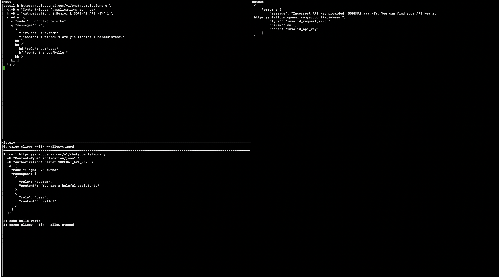

  <h1>vshell</h1>

  

    <strong>v(oice) shell - a shell optimized for voice usage</strong>
  

# Compatibility
-  [x] mac
-  [?] linux 
-  [x] windows - although some commands built into the windows shell may not work because on windows they are builtins but they are not built into vshell itself (yet?)
  
# Features
Go [here](https://github.com/paul-schaaf/vshell-commands) for a list of talon commands that use the shell's features.

- [x] basic shell functionality
- [x] pinned commands (pinned commands stay at the top of the history (see screenshot))
- [x] command history (see screenshot)
- [x] working directory history 
- [x] hints to edit and navigate input and copy parts of output
- [x] execute commands using other shells (`bash`,`zsh`,`fish` etc.)
- [x] search and replace
- [x] select directories by clicking
- [ ] expanding globs(*)
- [ ] unicode support
- [ ] piping commands
- [ ] redirecting commands
- [ ] aliases
- [ ] searching history
- [ ] pagination
- [ ] variable expansion
- [ ] ssh

# Known Bugs
  - if your input is larger than the window for it, the program will crash

# Installation

1.
- clone this repo and run `cargo build --release`
- or use `cargo install` with the `--git` flag

2.
- clone [this repo](https://github.com/paul-schaaf/vshell-commands) for the talon commands. It defines a tag that you can insert into your terminal.talon file.
